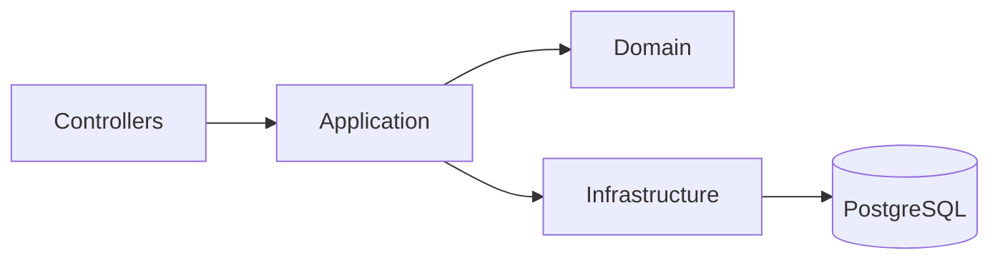
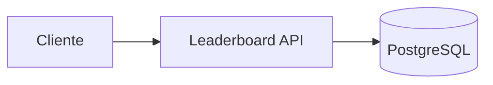
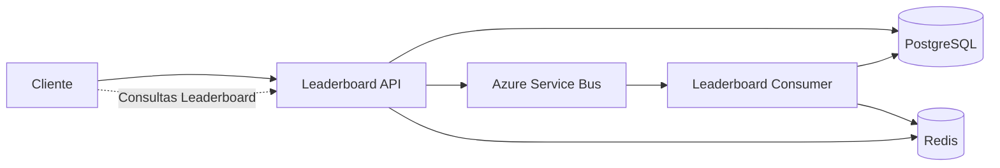
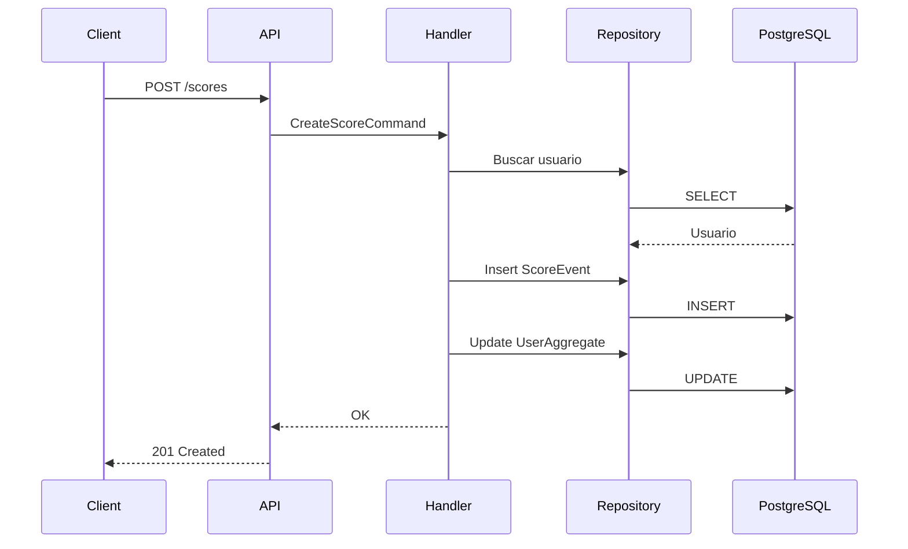
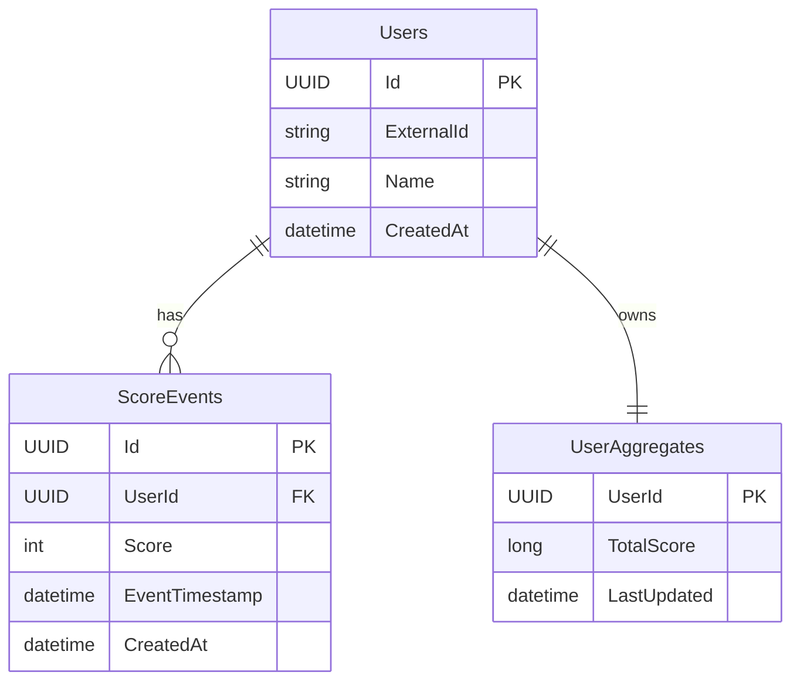
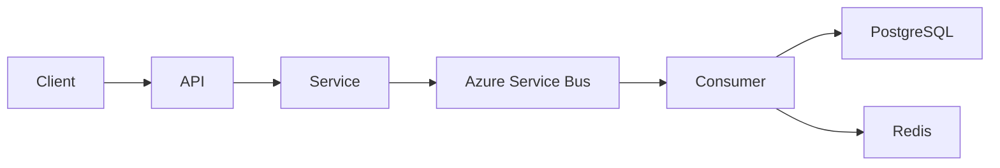
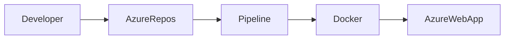

# Leaderboard Service - SOLUTION.md

## Autor

Wilkar Márquez

---

# 1. Introducción

Se desarrolló un servicio REST utilizando **ASP.NET Core 10**, **Entity Framework Core**, **PostgreSQL**, **CQRS**, **MediatR** y **Clean Architecture**.

El objetivo del servicio es registrar puntuaciones de usuarios y consultar un leaderboard considerando una ventana de tiempo configurable.

La solución implementa un prototipo funcional priorizando:

- Correctitud
- Simplicidad
- Consistencia
- Facilidad de evolución a producción

---

# 2. Arquitectura

La solución sigue una variante de **Clean Architecture**.



Cada capa tiene una única responsabilidad.

|Proyecto|Responsabilidad|
|---------|---------------|
|Leaderboard.Api|HTTP, Controllers, Middleware|
|Leaderboard.Application|CQRS, Validaciones, Casos de Uso|
|Leaderboard.Domain|Entidades, Interfaces|
|Leaderboard.Infrastructure|Persistencia EF Core, Repositorios|


---

# 2.1. Evolución de la arquitectura

La solución implementada corresponde a un **prototipo funcional**, priorizando simplicidad, consistencia y facilidad de despliegue. Sin embargo, la arquitectura fue diseñada pensando en una evolución gradual hacia un entorno de producción con altos volúmenes de tráfico.

## Arquitectura implementada



### Características

- Arquitectura monolítica.
- Persistencia en PostgreSQL.
- CQRS con MediatR.
- Unit of Work para garantizar consistencia transaccional.
- El leaderboard se calcula sobre `ScoreEvents` utilizando una ventana de tiempo configurable.

Esta solución es adecuada para un prototipo y garantiza resultados correctos en tiempo casi real con una infraestructura mínima.

---

## Arquitectura propuesta para producción



### Mejoras incorporadas

- Separación entre escritura y lectura (CQRS).
- Procesamiento asíncrono mediante Azure Service Bus.
- Caché en Redis para responder consultas del leaderboard con baja latencia.
- Consumidores escalables horizontalmente para procesar eventos.
- Base de datos dedicada como fuente de verdad (Source of Truth).

Con esta arquitectura, cada nuevo score se publica como un evento. Los consumidores actualizan los agregados y la caché en pocos milisegundos, permitiendo mantener el leaderboard actualizado en **near-real-time** incluso con altas tasas de escritura.

---

## Comparación

| Característica | Prototipo | Producción |
|----------------|-----------|------------|
| Persistencia | PostgreSQL | PostgreSQL |
| Leaderboard | Calculado en consulta | Agregados precalculados |
| Actualización | Transacción síncrona | Eventos + Consumer |
| Lecturas | Base de datos | Redis |
| Escalabilidad | Vertical | Horizontal |
| Consistencia | Fuerte | Eventual (milisegundos) |
| Complejidad | Baja | Media/Alta |
| Throughput esperado | Miles de req/s | Hasta 100.000 req/s (escalando consumidores y caché) |

---


# 3. Flujo de la solución

## Registrar Score



Todo ocurre dentro de una misma transacción utilizando Unit Of Work.

Esto garantiza consistencia.

---

# 4. Modelo de datos



---

# 5. Decisiones de diseño

## ¿Por qué Event Sourcing parcial?

Cada score nunca se modifica.

Se almacena como un evento inmutable.

Esto permite:

- Auditoría
- Reprocesamiento
- Escalabilidad futura

---

## ¿Por qué UserAggregate?

El endpoint

GET /users/{id}/score

no necesita recorrer todos los eventos.

Puede responder en tiempo constante.

---

## ¿Por qué el leaderboard consulta ScoreEvents?

El requerimiento indica:

> últimos X días configurables

Por este motivo UserAggregate no es suficiente, ya que almacena el histórico completo.

Se decidió calcular el leaderboard utilizando ScoreEvents filtrando por la ventana configurada.

---

# 6. Consistencia

La solución utiliza:

- Entity Framework Core
- PostgreSQL
- Unit Of Work
- Transacciones

Cada POST ejecuta:

1. Buscar o crear usuario
2. Insertar ScoreEvent
3. Actualizar UserAggregate
4. Commit

Esto evita:

- Actualizaciones perdidas
- Estados inconsistentes
- Escrituras parciales

---

# 7. Near Real-Time

El requerimiento solicita:

> soportar actualización near-real-time.

La solución actual cumple este requisito debido a que:

- ScoreEvent y UserAggregate se actualizan dentro de la misma transacción.
- Una vez confirmado el Commit, cualquier consulta posterior observa inmediatamente el nuevo estado.

No existen procesos batch ni sincronizaciones diferidas.

---

# 8. Hot Keys

## Posible problema

Un mismo usuario puede recibir miles de escrituras por segundo.

La fila de UserAggregate podría convertirse en un punto de contención.

## Mitigación

En producción se propone:

- Kafka / Azure Service Bus
- Particionamiento por UserId
- Consumers paralelos
- Redis para lectura

De esta manera múltiples consumidores procesan diferentes usuarios evitando contención.

---

# 9. Escalabilidad

La solución implementada está pensada para un prototipo.

Para soportar aproximadamente 100.000 req/s se propone evolucionar la arquitectura.



Flujo:

POST

↓

Guardar evento

↓

Publicar evento

↓

Consumer actualiza leaderboard

↓

Redis responde lecturas

Beneficios

- Escrituras desacopladas
- Escalabilidad horizontal
- Menor latencia
- Near Real Time (<1 segundo)

---

# 10. Leaderboard propuesto para producción

Actualmente el leaderboard calcula:

SUM(score)

sobre ScoreEvents.

En producción se propone una nueva tabla.

LeaderboardAggregates

```text
UserId

RollingScore

WindowStart

LastUpdated
```

Cada evento recibido actualizaría esta tabla.

GET /leaderboard solo ejecutaría

```sql
SELECT *
FROM LeaderboardAggregates
ORDER BY RollingScore DESC
LIMIT @Top;
```

---

# 11. Trade-offs

## Solución implementada

Ventajas

- Simple
- Fácil de mantener
- Consistente
- Exacta

Desventajas

- El leaderboard requiere agregaciones en cada consulta.

---

## Solución propuesta

Ventajas

- Mucho mayor throughput
- Menor latencia
- Horizontalmente escalable

Desventajas

- Mayor complejidad
- Consistencia eventual
- Más componentes

---

# 12. Plan de despliegue

Se propone el siguiente flujo utilizando Azure DevOps.



Pipeline

1 Build

2 Unit Tests

3 Integration Tests

4 Publicación Docker

5 Deploy

---

# 13. Rollback

El despliegue debe mantener siempre la versión anterior disponible.

Si la nueva versión presenta errores:

- detener despliegue
- restaurar imagen anterior
- restaurar migración si aplica

Tiempo estimado:

menos de 5 minutos.

---

# 14. Seguridad

Se recomienda:

- JWT Bearer Authentication
- Validación mediante FluentValidation
- HTTPS obligatorio
- Rate Limiting
- Idempotency-Key para evitar duplicados
- Sanitización de entradas
- Secretos en Azure Key Vault

---

# 15. Observabilidad

La solución puede integrarse con:

- OpenTelemetry
- Application Insights
- Serilog

Métricas recomendadas

- Requests por segundo

- Tiempo promedio

- Número de errores

- Leaderboard Response Time

- Database Response Time

---

# 16. Complejidad

Registrar score

O(1)

Consultar score

O(1)

Leaderboard

O(N log N)

donde N corresponde al número de eventos dentro de la ventana configurada.

En producción:

Leaderboard

O(log N)

utilizando Redis y LeaderboardAggregates.

---

# 17. Uso de Inteligencia Artificial

Durante el desarrollo se utilizó inteligencia artificial como herramienta de apoyo para:

- revisión de arquitectura
- generación inicial de diagramas Mermaid
- revisión de buenas prácticas en Clean Architecture
- refinamiento de documentación técnica

Todas las decisiones de diseño, implementación, validación y adaptación fueron analizadas, ajustadas y verificadas manualmente antes de incorporarse al proyecto.